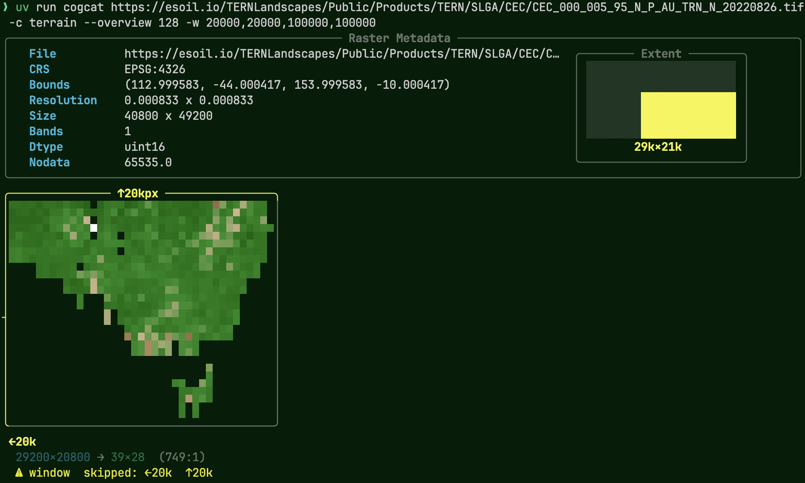

# cogcat

`cat` for GeoTIFFs. Renders raster files directly in your terminal using half-block ANSI characters via [rich-pixels](https://github.com/darrenburns/rich-pixels). Works over SSH, in headless environments, and loads fast even for large COGs.

Supports any [rasterio-compatible format](https://gdal.org/drivers/raster/index.html) — GeoTIFF, COG, JPEG2000, NetCDF, and more.

Inspired by [Simon Willison](https://simonwillison.net/2025/Sep/2/rich-pixels/)

## e.g.

Preview a remote Cloud-Optimised GeoTIFF (TERN soil CEC data):

```bash
cogcat https://esoil.io/TERNLandscapes/Public/Products/TERN/SLGA/CEC/CEC_000_005_95_N_P_AU_TRN_N_20220826.tif
```


## Install

Run directly without installing:

```bash
uvx git+https://github.com/harryeslick/cogcat.git
```

Or install from GitHub:

```bash
uv pip install git+https://github.com/hfsi/cogcat.git
```

With matplotlib colormaps:

```bash
uv pip install "cogcat[colormaps] @ git+https://github.com/hfsi/cogcat.git"
```

## Usage

```
cogcat <source> [OPTIONS]
```

### Arguments

| Argument | Description |
|---|---|
| `source` | Path or URL to a raster file (required) |

### Options

| Option | Short | Default | Description |
|---|---|---|---|
| `--bands` | `-b` | auto | Comma-separated band numbers (e.g. `4,3,2`). Negative indexes count from last band (`-1` = last). |
| `--colormap` | `-c` | `viridis` | Colormap for single-band display. Built-in: `viridis`, `terrain`, `grayscale`. All matplotlib colormaps available with `[colormaps]` extra. |
| `--histogram` | `-H` | off | Show a pixel value histogram below the image. |
| `--full` | | off | Load the entire raster instead of a terminal-sized subset. May be slow for large files. |
| `--window` | `-w` | none | Custom read window as `xoff,yoff,width,height` in pixel coordinates. Negative offsets count from right/bottom edge. |
| `--no-meta` | | off | Hide the metadata panel. |
| `--no-inset` | | off | Hide the crop extent inset overlay. |
| `--timeout` | | `10` | URL fetch timeout in seconds. |
| `--margin-rows` | | `2` | Terminal rows to reserve for the shell prompt. |
| `--overview` | | none | Render a specific overview level (e.g. `2`, `4`, `8`, `16`). |
| `--help` | | | Show help and exit. |

## Examples

Preview a local GeoTIFF:

```bash
cogcat image.tif
```

Single-band DEM with terrain colormap and histogram:

```bash
cogcat dem.tif -c terrain --histogram
```

False-color composite (NIR, Red, Green):

```bash
cogcat sentinel.tif -b 4,3,2

# accepts python style negative indexes eg `-b -1` to show the last band. 
```

Use a specific overview level for a quick look at a large COG:

```bash
cogcat large_cog.tif --overview 128
```

Image only, no metadata panel:

```bash
cogcat image.tif --no-meta
```

Read a specific region:

```bash
cogcat large.tif -w 1000,2000,500,500
```

Run without installing via `uvx`:

```bash
uvx git+https://github.com/harryeslick/cogcat.git https://esoil.io/TERNLandscapes/Public/Products/TERN/SLGA/CEC/CEC_000_005_95_N_P_AU_TRN_N_20220826.tif -c terrain
```




## Github Actions

Use within github actions to quickly verify any tiffs in your workflow look as expected. 

GitHub Actions runners have no TTY resulting in: no ANSI color | terminal width not detected.

Solution: Environment variables in the workflow

```yaml
    env:
      FORCE_COLOR: "1"
      COLUMNS: "120"
```

## How It Works

1. Opens the raster and reads metadata (CRS, bounds, resolution, bands) without loading pixels.
2. Calculates the terminal's available pixel area (columns × rows × 2, using half-block characters).
3. Selects the best overview level or reads a center crop to avoid loading unnecessary data.
4. Downsamples to terminal size using rasterio's `out_shape`.
5. For multi-band: applies 2–98% percentile stretch per band for good contrast.
6. For single-band: applies the selected colormap.
7. Renders using `rich-pixels` half-block characters.
